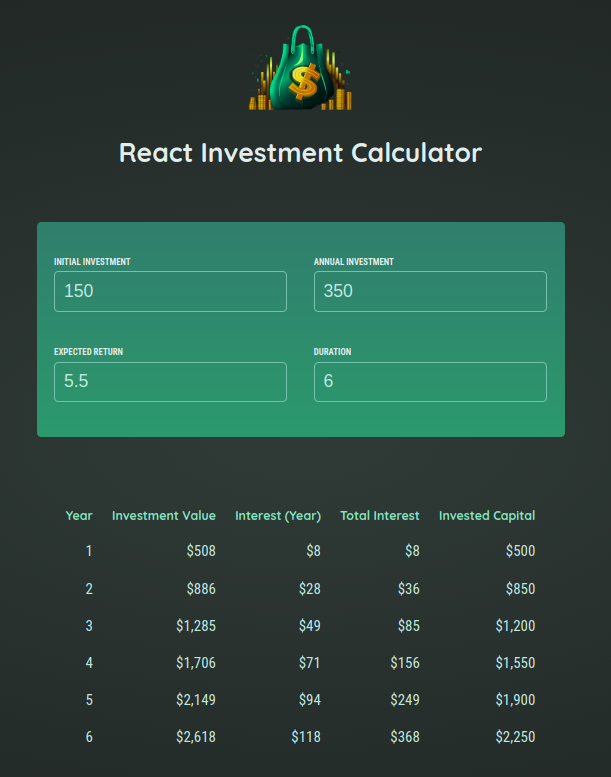
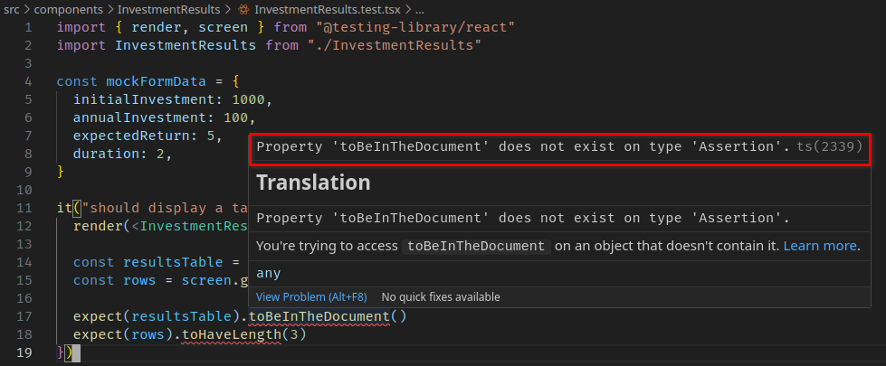

# Investment Calculator

This is an investment calculator developed to put into practice all the testing skills I have been delving into in the past month.

This was an attempt to create tests for the components based on the expected behavior of the application as well as how users would use the app and expect it to function.

## Table of Contents

- [Tools](#tools)
- [Installation & Running the Application](#installation--running-the-application)
- [How to Use The Project](#how-to-use-the-project)
- [Challenges Faced](#challenges-faced)
- [Next Steps](#next-steps)
- [Credits](#credits)

## Tools

For this project, I used:

- React.js
- TypeScript
- CSS3
- Vite
- Vitest
- Cypress
- React Testing Library

I also wanted to practice creating React apps with TypeScript and was happy to develop this from scratch.

## Installation & Running the Application

You can clone this project to your local machine with this command on your CLI:

- HTTPS

```bash
$ git clone https://github.com/Will-Andrade/react-investment-calculator.git
```

- SSH

```bash
$ git clone git@github.com:Will-Andrade/react-investment-calculator.git
```

To access the new folder and install dependencies, you can use this:

```bash
$ cd react-investment-calculator
$ yarn install
```

Finally, to run the application, simply use this command:

```bash
$ yarn dev
```

Note: Please checkout the `package.json` file to understand what other scripts exist on the application.

Finally, you are welcome to contribute to this project and would be great if you could help me fix the issues noted on the "Challenges Faced" section.

## How to Use The Project

After opening the application on your browser of choice, you'll be greeted with this screen:



Where each input represents the following:

- Initial investment: this is your initial investment;
- Annual investment: represents the total amount of money that you wish to invest per year;
- Expected return: represents the expected outcome of your investment (in percentage);
- Duration: represents the duration (in years) of your invesment strategy;

Based on these values, a table containing the results of the operation is shown below the inputs.

## Challenges Faced

~~I ran into some problems related to using BDD and TDD on this project, since it was the first time I applied these concepts all by myself.~~

~~I had trouble fixing some issues related to my tests files. For example, on the `investmentResult.test.tsx` I ran into the error:~~



~~Even tough I installed and configured vitest to understand both assertions from jest and React Testing Library, as well as configuring the use of `js-dom`, I couldn't get rid of this error on all test files. At the end of the day, the tests work as expected but this is a weird bug that I coudln't fix while developing them.~~

~~Finally, since I couldn't fix these errors on the test files, I couldn't properly host the project on Vercel. The build process fails due to them.~~

### UPDATE

I managed to fix the issues related to the test suites and build process with [PR #7](https://github.com/Will-Andrade/react-investment-calculator/pull/7). Apparently, what was causing the issues with the tests was a wrongful import inside the ```setupTests``` file. Instead of importing this:
```ts
import "@testing-library/jest-dom/vitest"
```

I should have been importing this:
```ts
import "@testing-library/jest-dom"
```

Plus, I had an unused function inside the ```cypress.config``` file that needed to be deleted:
```ts
...
setupNodeEvents(on, config) {
  // implement node event listeners here
},
...
```

## Next steps

~~First: Fix these errors related to the tests and make sure the build process is executed successfully on Vercel so I can host the project on the cloud and update the repository with the URL to it.~~

Second: Make better tests. I plan to continue creating projects with TDD, BDD and the testing knowledge I have right now. In time, I will be updating this project with new found knowledge and practices.

## Credits

I got the idea for this project from [
Maximilian Schwarzmüller](https://github.com/maxschwarzmueller), specifically from his course _React - The Complete Guide 2024 (incl. React Router & Redux")_. Thanks a ton, Max!

The idea and initial project setup was given by him. Everything else I managed to create on my own with the knowledge I have at the moment! For example, using TypeScript instead of JavaScript and adding tests to the project.
